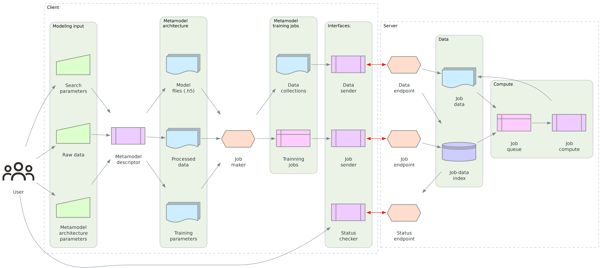

# tf-remote

> [!WARNING]
> **This is is a work in progress!**

## Summary
`tf-remote`is a library for creatting and trainning machine learning models using tensorflow. It is structured around a simple achtechture where the client creates multiple models and process the input data accordingly to create trainning jobs. Then, those jobs can be performed on a remote server. 

## Structure

### Conventions
- Each **model** is provided as an `model.h5` file.
- Each **dataset** is provided as a standard *numpy array*, and is tied to a **data identifier**.
- The model trainning is based on a set of **hyperparameters**.
- Each **trainning job** is defined as the collection **model** + **data identifier** + **hyperparameters**. Therefore, it is possible to use several combinations of these.

### Workflow
1. The *client* creates a set of **trainning jobs** and related **datasets**.
2. The *client* sends the **datasets** via API to the *server*.
3. The *client* sends the **trainning jobs** via API to the *server*.
    - Each **trainning job** is accepted only if there is already an specified **dataset** compatible with its **data identifier**.
4. The *server* continuously matain a queue with all the **trainning jobs** available to be performed.
5. The *server* performs each **trainning job** inthe queue, and saves the results.
6. The *cleint* can request information from the *server* at anytime:
    - Status: returns the current size of the queue and the amount of jobs already performed.
    - Results: 
        - Table: returns a table with all information on its **trainning jobs**.
        - Model: returns the rtesulting model files `model.h5` for a speccific **trainning job**.

### Archtechture
