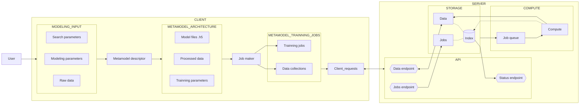

```mermaid
%%{ init: { 'flowchart': { 'curve': 'linear' } } }%%
graph LR

    User 
    
    subgraph CLIENT

        subgraph MODELING_INPUT
            direction LR
            c_search_par[Search parameters]
            c_mod_par[Modeling parameters]
            c_data_raw[Raw data]
            end

        c_meta_mod[Metamodel descriptor]
        
        subgraph METAMODEL_ARCHITECTURE
            direction LR
            c_model_files[Model files .h5 ]
            c_data_proc[Processed data]
            c_par_train[Trainning parameters]
            end

        c_job_maker[Job maker]
        
        subgraph METAMODEL_TRAINNING_JOBS
            direction LR
            c_data_col[Data collections]
            c_jobs[Trainning jobs]
            end

        MODELING_INPUT --> c_meta_mod
        c_meta_mod --> METAMODEL_ARCHITECTURE
        METAMODEL_ARCHITECTURE --> c_job_maker
        c_job_maker --> c_data_col & c_jobs
        
        METAMODEL_TRAINNING_JOBS --> Client_requests

        end

    User --> MODELING_INPUT

    subgraph SERVER
        direction LR

        subgraph API
            direction LR
            s_e_data{{Data endpoint}}
            s_e_jobs{{Jobs endpoint}}
            s_e_status{{Status endpoint}}
            end

        subgraph STORAGE
            direction LR
            s_index[(Index)]
            s_jobs[Jobs]
            s_data[Data]
            
            s_jobs[Jobs] & s_data[Data] -.- s_index[(Index)]
            end
        
        s_e_data <--> s_data
        s_e_jobs --> s_jobs
        s_index --> s_e_status 
        
        subgraph COMPUTE
            direction LR
            s_queue[Job queue]
            s_compute[Compute]
            end
            
        STORAGE --> s_queue
        
        s_queue --> s_compute --> s_data
        s_compute -.-> s_index
    
    Client_requests <--> API

    end
```